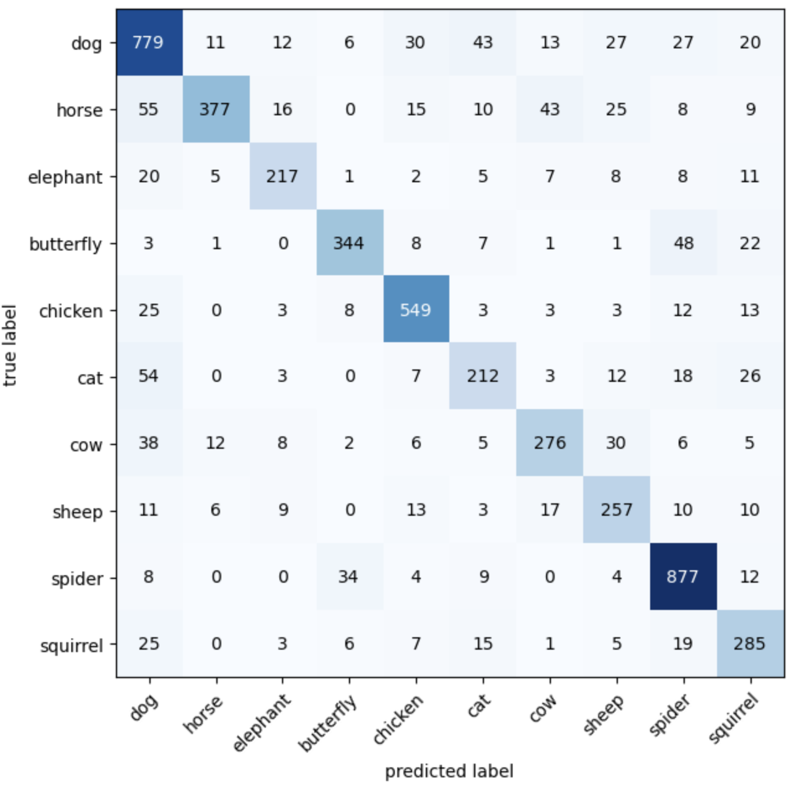

# Animals Hangman 🐘 🐶 🐓 🐈

Welcome to **Animals Hangman**, a fun and interactive game where uploaded images of animals are used to create a classic
hangman experience!

## How It Works:

1. **Upload Your Images**  
   Start by uploading images of animals you'd like to include in the game.

2. **Random Image Selection**  
   After uploading, the system randomly selects one of the images to use for the game.

3. **Image Processing**  
   The selected image is converted into bytes and sent as a request to the `/predict` endpoint of
   the [Animals Prediction API](https://animals-prediction-api.onrender.com/docs).

4. **Prediction via Neural Network**  
   The API uses a Convolutional Neural Network (CNN) trained on over 60,000 images across 10 animal
   classes: `dog`, `horse`, `elephant`, `butterfly`, `chicken`, `cat`, `cow`, `sheep`, `spider`, and `squirrel`.  
   ⚠️ Currently, the model can only classify images of these 10 animals.

5. **API Response**  
   The API returns:
    - The predicted animal for the selected image.
    - The probabilities of the image belonging to each of the 10 classes (the prediction corresponds to the highest
      probability).

6. **Game Setup**  
   The system uses the prediction for the selected image to generate the hangman puzzle.

7. **Playing the Game**
    - Make guesses to uncover the animal's name.
    - Feedback is provided for each guess, indicating whether it's correct or incorrect.
    - You have up to **6 incorrect guesses** to complete the hangman.

8. **Winning or Losing**
    - If you guess the animal's name correctly, 🎈 **celebratory balloons** appear!
    - If you exceed 6 incorrect guesses, ❌ **a rain of "X" emojis** will mark the loss.
    - In both cases, a button to start a new game becomes available.

9. **Detailed Feedback**
    - An **explanation panel** will display the probabilities for each animal class for the selected image.
    - If a misclassification is noticed, users can report it directly through the interface. The reported image will be
      stored for future retraining of the model, improving its accuracy over time.

10. **Model Training**
    - For more details about the model training, see
      the [model's notebook](https://github.com/BrunoSudre/animals-prediction-cnn/blob/master/animal-cnn-classification.ipynb)

Enjoy playing and discovering animals with **Animals Hangman**!

## Model Status: Strengths and Limitations

The **Animals Prediction API** uses a Convolutional Neural Network trained on over 60,000 images of 10 animal classes.
While the model performs well overall, the confusion matrix of the test dataset reveals some class imbalances in the
True Positive predictions.

### Key Observations:

- Certain animals, such as `spider`, `dog`, and `chicken`, are more likely to be predicted correctly compared to others.
- Classes like `cat`, `elephant`, and `squirrel` exhibit lower True Positive rates and are more prone to
  misclassification.
- Misclassifications often occur between animals with similar features or shapes, such as `horse` and `cow`, or `cat`
  and `dog`.

### Confusion Matrix:

Below is the confusion matrix generated from the test dataset, illustrating the model's performance across all classes:

### Limitations:

- The imbalanced True Positives indicate that some classes dominate the model's predictions due to either higher
  representation in the training data or their distinctive features.
- The current model may struggle with edge cases or images with poor quality or unusual angles.

### Next Steps:

To address these limitations, the following improvements are planned:

1. **Data Augmentation**: Enhance the dataset with underrepresented classes through data augmentation techniques.
2. **Model Retraining**: Incorporate misclassified images into the training dataset for better generalization.
3. **User Feedback Integration**: Allow users to report incorrect classifications, so the model can learn from
   real-world usage scenarios.

By understanding these limitations, users can better interpret the model's predictions and contribute to its continuous
improvement!